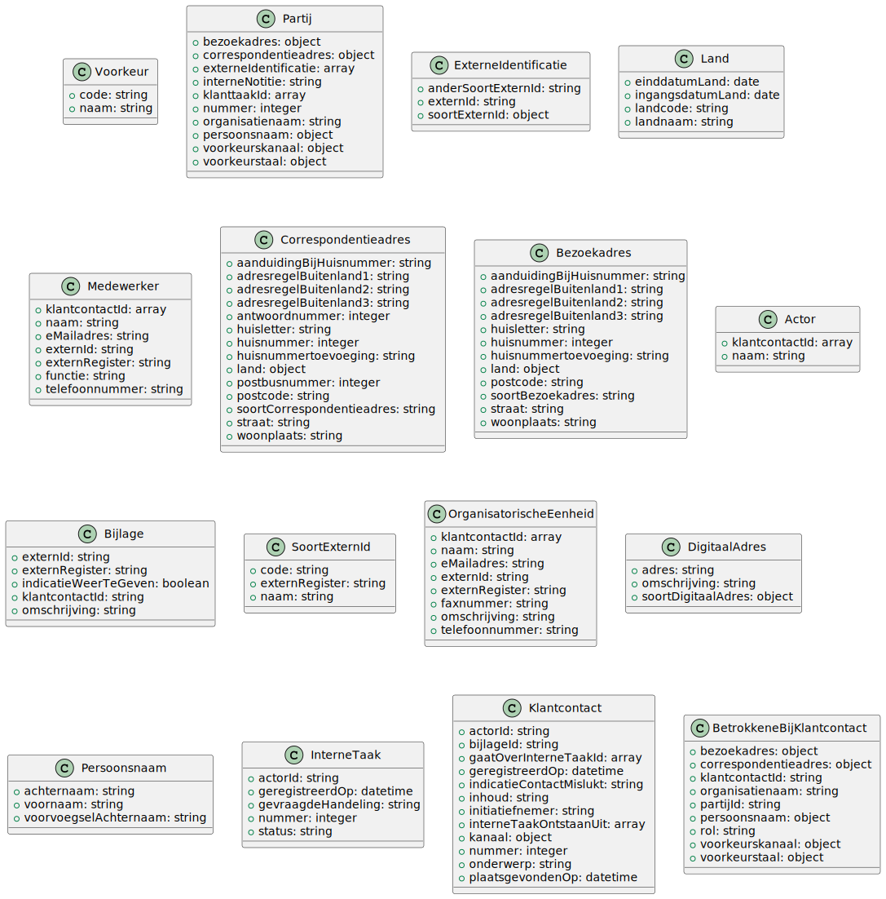

# Schema Documentation

## Table of Classes

| Class | Documentation |
|-------|--------------|
| BetrokkeneBijKlantcontact | [klant.betrokkeneBijKlantcontact.md](klant.betrokkeneBijKlantcontact.md) |
| Partij | [klant.partij.md](klant.partij.md) |
| Bijlage | [klant.bijlage.md](klant.bijlage.md) |
| Actor | [klant.actor.md](klant.actor.md) |
| Voorkeur | [klant.voorkeur.md](klant.voorkeur.md) |
| Correspondentieadres | [klant.correspondentieadres.md](klant.correspondentieadres.md) |
| Medewerker | [klant.medewerker.md](klant.medewerker.md) |
| Klantcontact | [klant.klantcontact.md](klant.klantcontact.md) |
| Bezoekadres | [klant.bezoekadres.md](klant.bezoekadres.md) |
| Organisatorische Eenheid | [klant.organisatorischeEenheid.md](klant.organisatorischeEenheid.md) |
| Digitaal Adres | [klant.digitaalAdres.md](klant.digitaalAdres.md) |
| Land | [klant.land.md](klant.land.md) |
| InterneTaak | [klant.interneTaak.md](klant.interneTaak.md) |
| Soort Extern Id | [klant.soortExternId.md](klant.soortExternId.md) |
| Persoonsnaam | [klant.persoonsnaam.md](klant.persoonsnaam.md) |
| Externe Identificatie | [klant.externeIdentificatie.md](klant.externeIdentificatie.md) |
